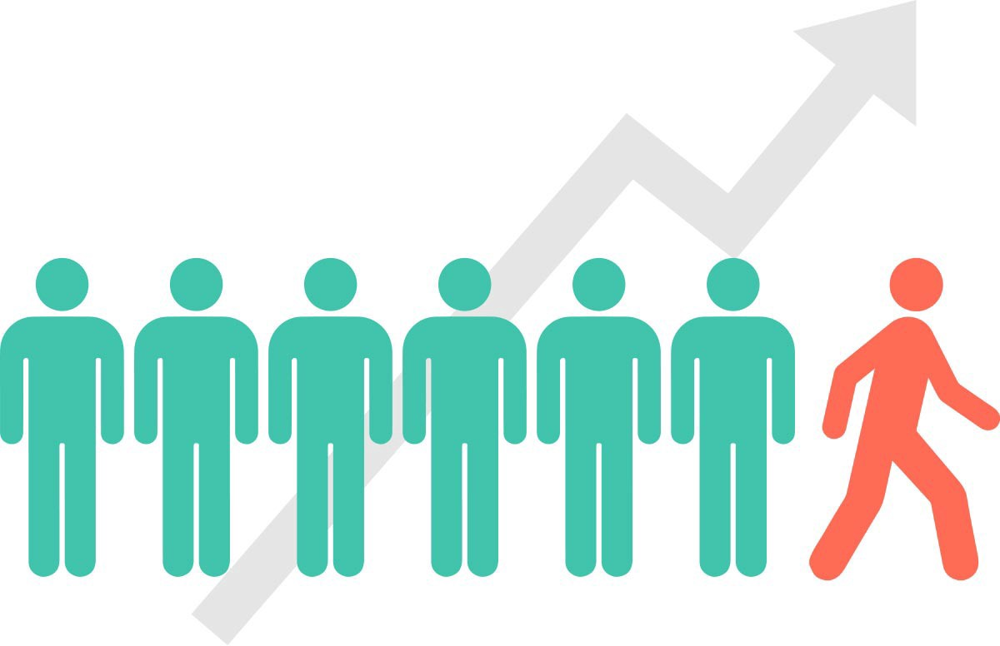

# CUSTOMER CHURN PREDICTION
### Predicting Customer Churn with Machine Learning Classification Algorithm.

 

 

## About the project
*Churn* can be defined as customer who stop, discontinue, or unsubscribe to a service or business. On a business, maintaining a customer was an important thing to do, yet it could be really hard to do. One way to predict customer behaviour is to analyse customer based on data. In the era of Big Data and Machine Learning, we can learn about customer and analyse customer behaviour pattern to do a prediction.
By building a model, companies can predict customer who're at high risk of churn and find new strategy to maintain customers.

 

### **Objective**
Exploring and Analyze data and try to answer some question such as:
- What feature shows correlation to Churn Rate?
- Does the churn rate on the dataset skewed?
- How different the behaviour of customer who churned and don't?

Model Building and Metric:
- Whats the best accuracy of the model?
- What model predict the best?

 

***check full jupyter notebook here***

 
 

## Folder Structure

 

## TABLE OF CONTENT
- THE DATASET
- EXPLORATORY DATA ANALYSIS (EDA)
- MODEL RESULT AND CONCLUSION

 

## **THE DATASET**
Dataset sourced from IBM Telco Customer dataset, which uploaded on kaggle by BlastChar: https://www.kaggle.com/blastchar/telco-customer-churn

* dataset consist of 7043 row (customer) with 21 column (features) described as:
    - customerID        : unique id for each customer
    - gender            : gender of customer
    - SeniorCitizen     : whether the customer is a senior citizen (yes/no)
    - Partner           : whether the customer has a partner or not
    - Dependents        : whether the customer has a dependent or not 
    - tenure            : month count of customer has stayed on the company
    - PhoneService      : whether the customer has a phone service or not
    - MultipleLines     : whether the customer has multiple lines or not
    - InternetService   : customer's ISP (internet service provider)
    - OnlineSecurity    : whether the customer has online security or not
    - OnlineBackup      : whether the customer has online backup or not
    - DeviceProtection  : whether the customer has device protection or not
    - TechSupport       : whether the customer has tech support or not
    - StreamingTV       : whether the customer has streaming tv or not
    - StreamingMovies   : whether the customer has streaming movies or not
    - Contract          : contract term of customer
    - PaperlessBilling  : whether the customer has paperless billing or not
    - PaymentMethod     : customer's payment method
    - MonthlyCharges    : customer's amount of charges monthly
    - TotalCharges      : total amount of customer's charges
    - Churn             : whether the customer churned or not

 

## **EXPLORATORY DATA ANALYSIS (EDA)**
*check jupyter notebook for complete EDA and code*

 

### **Churn vs Not Churn ratio**

In the model, Churn is the target of the classification.

73,4 customer not churned. The dataset is skewed, but its normal since on a business, we expect there's more customer who stayed. However, this skewness can lead to false negatives. The skewness is handled with upsampling minorities(churn), so the ratio is balanced

 
 
 

### **Tenure, Monthly Charges, Total Charges**

tenure, MonthlyCharges, and TotalCharges are numerical feature on the data.

Analyse distribution:

 
 

MonthlyCharges vs TotalCharges

 
 
 

### **Categorical Features**
- Gender
- SeniorCitizen
- Partner
- Dependents

- PhoneService
- MultipleLines
- InternetService
- OnlineSecurity
- OnlineBackup
- DeviceProtection
- TechSupport
- StreamingTV
- StreamingMovies
- Contract
<!-- contract vs tenire -->

- Paperless Billing
- Payment Method

 
 
 

### **Correlation Matrix**
Correlation is 

Correlation Heatmap for every feature:

Correlation Heatmap on every feature to Churn:

5 Most Feature Correlated to Churn:

 
 
 

## **MODEL RESULT AND CONCLUSION**

The model was trained with train vs test data ratio of 70% train and 30% test.

I used 6 Machine Learning Algorithm to predict/classified customer as Churn or Not Churn:
- Random Forest
- Decision Tree
- XG Boost
- Adaboost
- Logistic Regression
- SVM

Model Accuracy Comparision:

 

## CONCLUSION
We've implemented Churn Prediction with several machine learning algorithm with performance accuracy of 75-88%. With this model, we can improve business, esspecially to maintain customer from churn or leaving. 